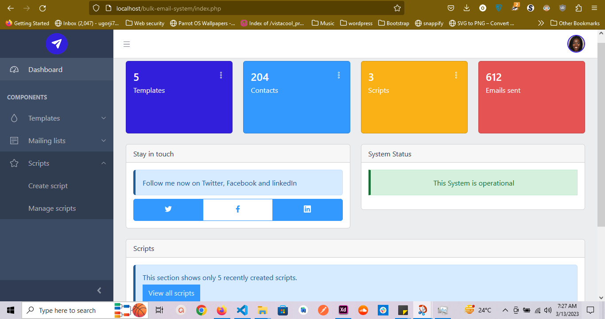

# BULK EMAIL SYSTEM

This software helps you to schedule and create scripts using templates that will send emails to your contact list.

> Before you proceed, please note that this is not a free software!

## 💥FEATURES

- You have the ability to upload a **template** that will be sent to your contacts `(*.html, *.txt)` files.

- You have the ability to upload a **mailing list.**

- You have the ability to create, execute and stop scripts.

## ⚡ INSTALLATION 

- Create a new database in your hosting server and import `/bulk_email_system.sql` into the database 

- Create an email account in your hosting server and make sure you take note of the username and password.

- Head over to `/core/env_sample.php` and attach values to the constants. When you are done, rename the file to `env.php`

- On your hosting server, create a cron job that will run every minute, every hour, every day, every week, and every year and then modify the command below to match the path to this file `/cron/run_script.php`.

    `
    ***** /usr/bin/pgrep /home/path/to/script.php || /usr/bin/php /home/path/to/script.php
    `

- Now open `/index.php` and you will be redirected to a signup page.

> Only one account is needed & used in this software version

## ✨ TECH-STACK

- PHP
- JavaScript
- MySQL
- Admin Dashboard [COREUI](https://coreui.io)